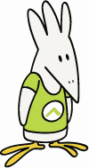

# Документация Parser 3.5.0

## Содержание документации

### Классы
- Array
 - Конструкторы
    - [create — создание массива с заданными значениями или пустого массива](./classes/array/constructors/create.md)
    - [copy — копирование массива или хеша](./classes/array/constructors/copy.md)
    - [sql — cоздание массива на основе выборки из базы данных](./classes/array/constructors/sql.md)
 - Поля
    - [поля объекта класса](./classes/array/fields/common.md)
 - Методы
    - [add — добавление элементов из другого массива или хеша с перезаписью](./classes/array/methods/add.md)

## Авторы

Язык скриптования сайтов Parser 3

Автор технологий Parser и Parser 3:

- Константин Моршнев

Авторы Parser 3:

- Александр Петросян (PAF)
- Михаил Петрушин (Misha v.3)

Авторы документации:

- Константин Моршнев
- Алексей Сорокин
- Владимир Муров
- Александр Петросян (PAF)

Адаптация для markdown:
- Евгений Лепешкин (Spearance)